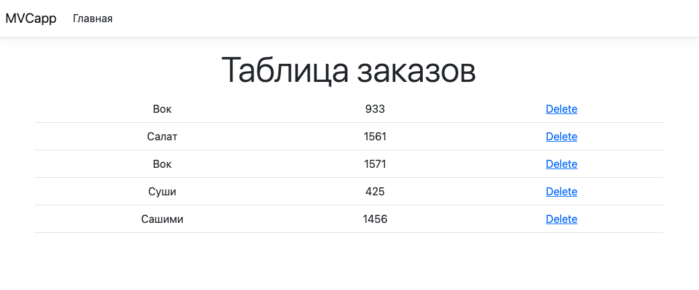
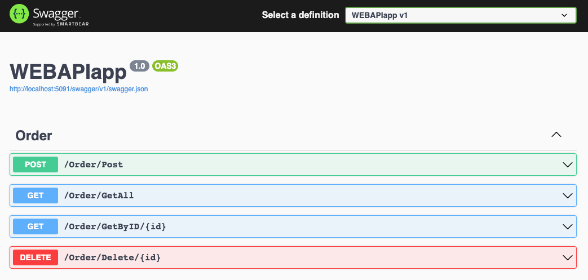

## Простое веб приложение на C#

Стек: VS Code, SQLite, EntityFramework, Newtonsoft.Json, Bootstrap.

## ТЗ

Необходимо сделать клиент серверное приложение на языке c#.
В качестве клиента - MVC веб приложение, к качестве сервера - web API приложение. 
В качестве бд можно использовать любой инструмент. 
Для подключения к базе используется ORM система entity franework. 
Для взаимодействия клиента и сервера используется httpclient и rest запросы. 
Для задания нужно осуществить получение списка заказов и удаление конкретного заказа. 
Для отображения можно использовать любые инструменты

## Как запустить

dotnet watch run --project ./backend/WEBAPIapp.csproj 
dotnet watch run --project ./frontend/MVCapp.csproj

Добавить новые заказы можно через Swagger UI (/order/post).